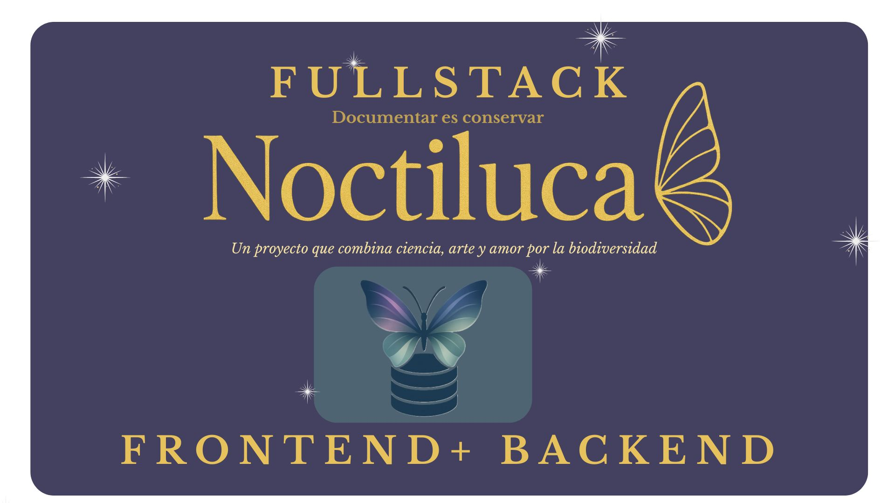

<p align="center">
  
</p>

## 🐛 Introducción

**Noctiluca** es una aplicación web interactiva diseñada para explorar, aprender y valorar la biodiversidad de polinizadores en diferentes continentes.  

Esta primera edición está centrada en Europa y ha sido desarrollada como parte de un proyecto colaborativo en un bootcamp de Desarrollo Fullstack + DevOps.  

🌍 Descubre mariposas de Europa en un entorno visual, educativo y accesible.

## 📂 Estructura del Proyecto
```
📦 fullstack-noctiluca-mongo
├── api-noctiluca-backend/   # Backend con Node.js, Express y MongoDB
│   ├── assets/              # Imágenes usadas en README (cover, postman, etc.)
│   ├── config/              # Configuración que carga variables de entorno, MONGO_URI
│   ├── controllers/         # Lógica de negocio con Mongoose
│   ├── database/            # Conexión a MongoDB
│   ├── middlewares/         # Validaciones y middlewares
│   ├── models/              # Modelos Mongoose
│   ├── routes/              # Endpoints de la API
│   ├── tests/               # Tests con Jest + Supertest
│   ├── .env                 # # Variables de entorno (desarrollo)
│   ├── .env.test            # Variables de entorno (test)
│   ├── app.js               # Configuración principal de Express
│   ├── server.js            # Arranque del servidor
│   └── package.json
│
└── Noctiluca-client/        # Frontend con React
    ├── public/
    ├── server/
    ├── src/
    │   ├── assets/
    │   ├── components/
    │   ├── layout/
    │   ├── pages/
    │   ├── router/
    │   ├── services/
    │   ├── style/
    │   └── test/
    ├── index.html
    ├── package.json
    └── vite.config.js
```
---
## ⚙️ Configuración

### 1️⃣ Clonar repositorio

```bash
git clone https://github.com/API-Noctiluca/fullstack-noctiluca-mongo.git
cd fullstack-noctiluca-mongo
```
2️⃣ Instalar dependencias en cada entorno

backend: 
```bash
cd api-noctiluca-backend
npm install
```

frontend: 
```bash
cd Noctiluca-client
npm install
```
3️⃣ Seguir la documentación específica de cada entorno

<ul>
  <li><a href="./api-noctiluca-backend/README.md" target="_blank">Backend</a></li>
  <li><a href="./Noctiluca-client/README.md" target="_blank">Frontend</a></li>
</ul>


```bash
🦋 Servidor corriendo en:
👉 http://localhost:5173/
```

---
## 🌐 Documentación Postman

Consulta toda la documentación de la API haciendo clic en el logo:

<a href="https://documenter.getpostman.com/view/46421388/2sB3HqJJas" target="_blank">
  
</a>

---


## ✨👩‍💻 Créditos Frontend 


Proyecto realizado por:

- Nicole Guevara  | Scrum Master & Developer
- Mariana Moreno| Product Owner & Developer
- Esther Tapias  |  Developer
- Rocío Coronel  |  Developer
- Valentina Montilla  |  Developer
- Maryori Cruz   |  Developer

## ✨👩‍💻 Créditos Backend 

Proyecto realizado por:

- Aday Alvarez | Scrum Master & Developer
- Nicole Guevara | Product Owner & Developer
- Guissella Perez |  Developer
- Julia Zarco  |  Developer
- Mariany De Araujo |  Developer

---
>“Noctiluca” significa luz nocturna, como la bioluminiscencia en el océano o el brillo sutil de los insectos en la oscuridad. Queremos que esta app sea una chispa de conocimiento que ilumine la importancia de los polinizadores en Europa.