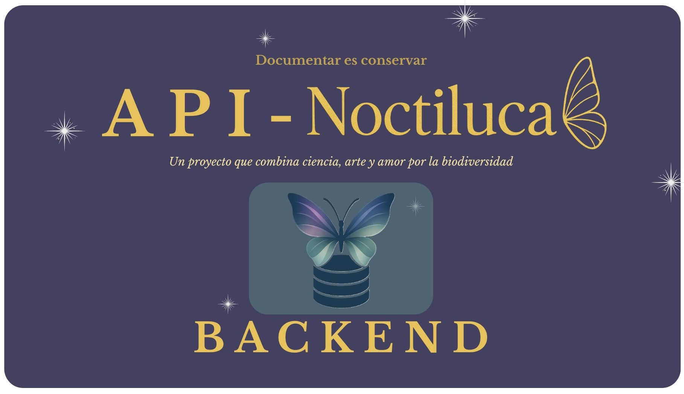
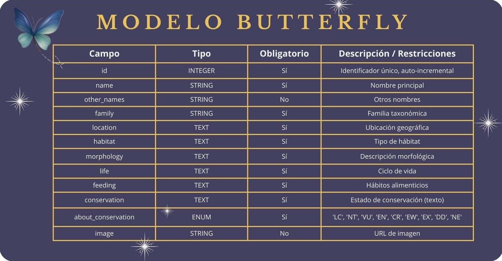

<p align="center">
  
</p>

## 🐛 Presentación

Este repositorio corresponde a la **parte 2 del proyecto [Noctiluca (Frontend)](https://github.com/nicolegugu93/Noctiluca)**.  
Aquí desarrollamos la **API REST con Node.js, Express y Sequelize**, que da soporte a la aplicación frontend.  

---

## 📂 Estructura del Proyecto

```bash
api-noctiluca/
│── assets/                 # Imágenes usadas en README (cover, table, postman, etc.)
│── config/                 # Configuración general (config.js)
│── controllers/            # Controladores (lógica de negocio)
│── database/               # Conexión con la base de datos
│── middlewares/            # Middlewares (ej. validaciones)
│── models/                 # Modelos de Sequelize
│── routes/                 # Definición de endpoints
│── tests/                  # Tests con Jest + Supertest
│── .env                    # Variables de entorno (desarrollo)
│── .env.test               # Variables de entorno (testing)
│── app.js                  # App principal de Express
│── server.js               # Arranque del servidor
│── package.json
│── README.md

```

## ⚙️ Configuración

### 1️⃣ Clonar repositorio
```bash
git clone https://github.com/API-Noctiluca/api-noctiluca.git
cd api-noctiluca

2️⃣ Instalar dependencias
npm install

3️⃣ Configurar variables de entorno
📄 .env (desarrollo)

DB_NAME=butterflies_db
USER_DB=root
PASSWORD_DB=tu_password
HOST=localhost
DB_DIALECT=mysql
PORT=4000

📄 .env.test (testing)

Copiar código
DB_NAME=butterflies_test
USER_DB=root
PASSWORD_DB=tu_password
HOST=localhost
DB_DIALECT=mysql
PORT=4000

4️⃣ Iniciar servidor
npm run dev

Servidor corriendo en:
👉 http://localhost:4000

```

---

## 🗄️ Base de Datos

La base de datos se gestiona con **MySQL + Sequelize**.  
Incluye el modelo principal `ButterflyModel`.

<p align="center">
  
</p>

---

## 🧩 Resumen de Lógica

- **Configuración** → sin esto no hay proyecto funcional.  
- **DB** → los modelos y tests necesitan un lugar donde guardar/leer datos.  
- **Tests** → guían la implementación según TDD.  
- **Modelo** → define cómo interactúas con la DB.  
- **Validadores** → aseguran que los datos sean correctos antes de tocarlos.  
- **Controladores** → implementan la lógica de negocio usando modelos y validadores.  
- **Rutas** → exponen la API al exterior.  
- **App** → junta todo para ejecutar.  
- **Tests** → comprueban que todo funcione correctamente.  

---

## 🧪 Testing

Se usa **Jest + Supertest** para pruebas unitarias y de integración.

### Ejecutar tests
```bash
Ejemplo de test

test('GET /butterflies should return array', async () => {
  const response = await request(app).get("/api/butterflies");
  expect(response.status).toBe(200);
  expect(response.body).toBeInstanceOf(Array);
});
```
## 📬 Endpoints

### 👉 GET all butterflies
```
GET /api/butterflies
```
--- 
### 👉 GET one butterfly
```
GET /api/butterflies/:id
```
---
### 👉 POST create butterfly
```
POST /api/butterflies
```
---
### 👉 Body (JSON)
```
{
  "name": "Papilio machaon",
  "family": "Papilionidae",
  "location": "Europa",
  "habitat": "Praderas",
  "morphology": "Alas amarillas con manchas negras",
  "life": "1 año",
  "feeding": "Néctar",
  "conservation": "Protegida",
  "about_conservation": "LC",
  "image": "machaon.jpg"
}
```
---
### 👉 PUT update butterfly
```
PUT /api/butterflies/:id
```
---
### 👉 DELETE butterfly
```
DELETE /api/butterflies/:id
```
---
## 💻 Ejemplos CURL
### 👉 GET all
```
curl -X GET http://localhost:4000/api/butterflies
```
---
## 👉 POST create
```
curl -X POST http://localhost:4000/api/butterflies \
-H "Content-Type: application/json" \
-d '{
  "name": "Papilio machaon",
  "family": "Papilionidae",
  "location": "Europa",
  "habitat": "Praderas",
  "morphology": "Alas amarillas con manchas negras",
  "life": "1 año",
  "feeding": "Néctar",
  "conservation": "Protegida",
  "about_conservation": "LC",
  "image": "machaon.jpg"
}'
```
---
## 🌐 Documentación Postman

Consulta toda la documentación de la API haciendo clic en el logo:

<div align="center">
  <a href="https://documenter.getpostman.com/view/46421388/2sB3HnJKMj" target="_blank">
    
  </a>
</div>

---

✨ Créditos

Proyecto realizado por:

- Aday Alvarez | Scrum Master & Developer
- Nicole Guevara | Product Owner & Developer
- Mariany De Araujo |  Developer
- Guissella Perez |  Developer
- Julia Zarco  |  Developer

---
